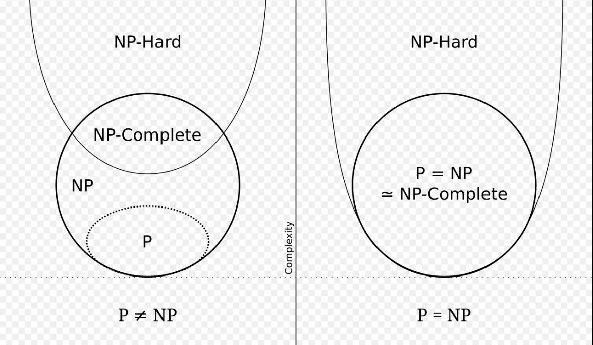

# P :在多項式時間內可以被確定性圖靈機解決的問題
# NP :在多項式時間內驗證驗證解是否正確
# NP-Complete:也是一種NP問題，所有NP問題都可以在多項式時間內被化簡為NPC，若任何NPC問題得到多項式時間內的解法，則該解法就可應用在所有NP問題上。
# P =? NP
    當 P = NP 正確時，所有的NP問題就可以在多項式時間內找到正確的解，密碼學的質數會被破解
    當 P != NP 正確時

